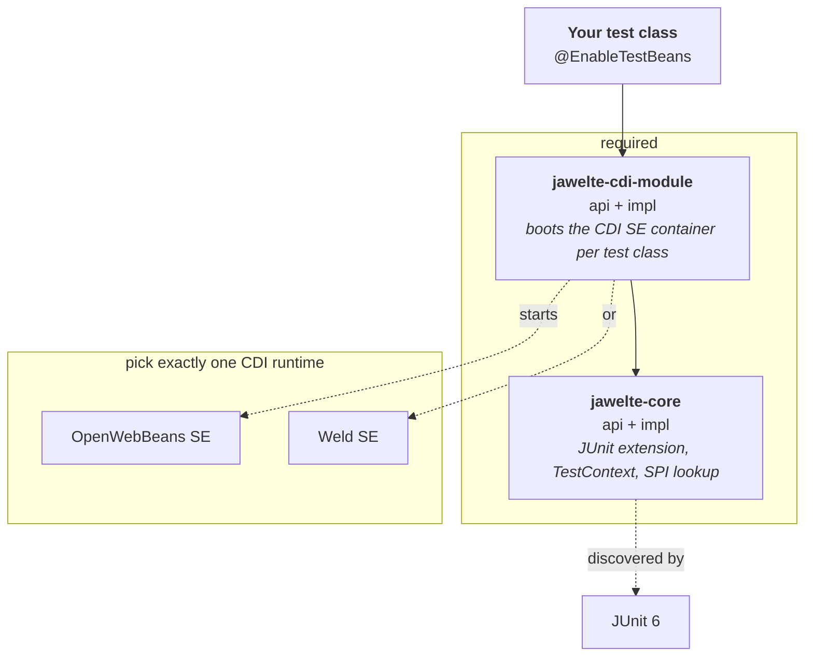
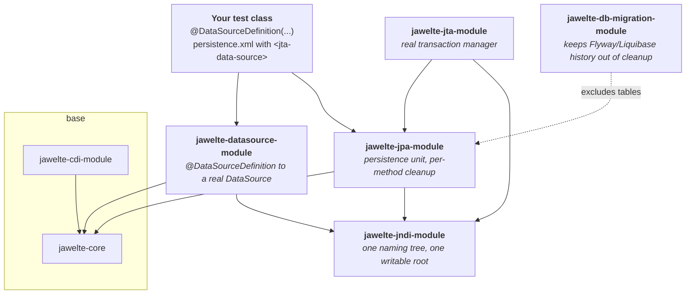
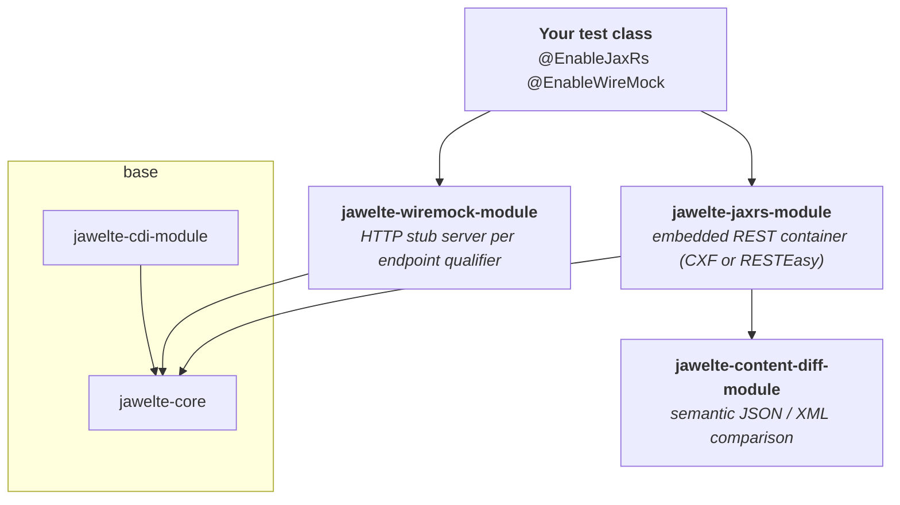
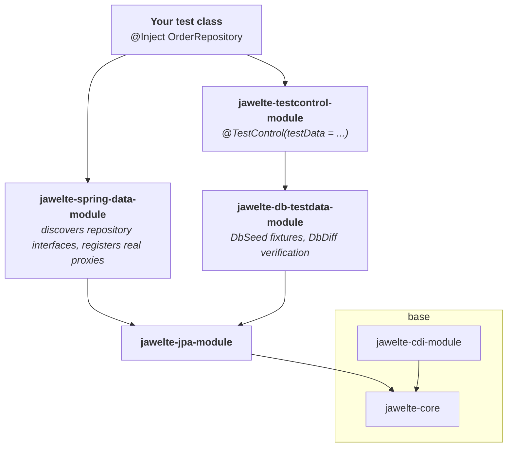
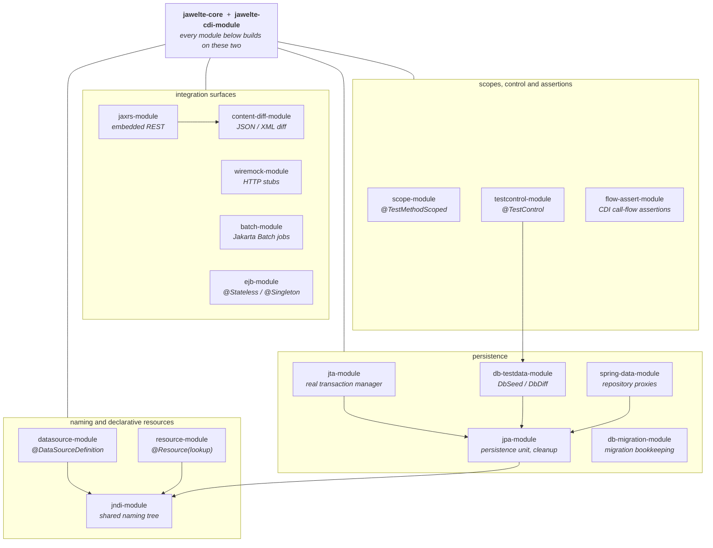

# jawelte

A JUnit 6 test framework for Jakarta EE 11 applications. Each test class gets its own CDI
SE container, and the platform's own annotations — `@DataSourceDefinition`, `@Resource`,
`@Transactional`, `persistence.xml` — mean in a test what they mean in production, so an
application's wiring runs unchanged.

Everything beyond the core is opt-in. You add the module for the technology you are
testing and nothing else; a module that is not on the classpath changes nothing, and most
modules are inert until you use their entry-point annotation.

---

## The minimal setup

Two jawelte artifacts, a CDI runtime, the Jakarta APIs and JUnit. Nothing else is required.



```xml
<dependency>
    <groupId>org.os890.jawelte</groupId>
    <artifactId>jawelte-cdi-module-impl</artifactId>
    <version>${jawelte.version}</version>
    <scope>test</scope>
</dependency>
<dependency>
    <groupId>org.os890.jawelte</groupId>
    <artifactId>jawelte-core-impl</artifactId>
    <version>${jawelte.version}</version>
    <scope>test</scope>
</dependency>
```

Both are needed: `jawelte-cdi-module-impl` brings `cdi-module-api` and `core-api` transitively,
but deliberately not `core-impl` — an `-impl` jar never depends on another module's `-impl`.
Without `jawelte-core-impl` the container does not start.

The Jakarta APIs, Mockito, JUnit and the CDI runtime are declared `provided` or `test` inside
jawelte, and neither scope is transitive — so a consuming project declares those itself too.
`skill/references/setup.md` carries a complete, verified minimal POM.

Add `jawelte-scope-module` when you want `@TestMethodScoped` / `@TestClassScoped`; without it the
framework falls back to `@Dependent` / `@RequestScoped` cleanly.

---

## Use case: persistence against the data source your application declares

A test that runs the real schema migration, the real persistence unit, and the real
transaction manager — with the database redirected to memory for the run.



The point of this subset: the `<jta-data-source>` name in `persistence.xml` resolves to the
data source the annotation declares, so schema migration through a plain `DataSource` and
reads through JPA hit **one** database — and the per-method row cleanup reaches both.

---

## Use case: a REST endpoint with its downstream stubbed



Your endpoint runs in a real REST container, its outbound calls hit a WireMock server
injected by qualifier, and the response is compared semantically rather than by string
equality.

---

## Use case: Spring Data repositories over JPA



---

## All modules

Everything currently shipped. `core` and `cdi-module` are the base; every other box is
optional and inert until used.



| Module | Covers |
| --- | --- |
| `jawelte-core` | JUnit 6 extension, `TestContext`, prioritized SPI lookup, configuration |
| `jawelte-cdi-module` | CDI SE container per test class, `@TestBean`, auto-mocking |
| `jawelte-scope-module` | `@TestMethodScoped` / `@TestClassScoped` |
| `jawelte-jndi-module` | the in-process naming tree every binding module shares |
| `jawelte-datasource-module` | `@DataSourceDefinition` — builds, binds and injects declared data sources |
| `jawelte-resource-module` | `@Resource(lookup = ...)` on application beans |
| `jawelte-jpa-module` | persistence unit, transaction lifecycle, per-method DB cleanup |
| `jawelte-jta-module` | a real transaction manager (Geronimo, Narayana, Atomikos) |
| `jawelte-db-migration-module` | keeps Flyway / Liquibase bookkeeping tables out of cleanup |
| `jawelte-db-testdata-module` | `DbSeed` fixtures and `DbDiff` verification |
| `jawelte-spring-data-module` | discovers Spring Data repository interfaces, registers real proxies |
| `jawelte-jaxrs-module` | embedded Jakarta REST container for endpoint tests |
| `jawelte-wiremock-module` | WireMock lifecycle, one stub server per endpoint qualifier |
| `jawelte-batch-module` | Jakarta Batch job execution with typed results |
| `jawelte-ejb-module` | `@Stateless` / `@Singleton` mapped onto CDI scopes |
| `jawelte-content-diff-module` | semantic JSON / XML comparison |
| `jawelte-testcontrol-module` | `@TestControl` — per-method scope filtering and DB fixtures |
| `jawelte-flow-assert-module` | records a test's CDI call-flow and asserts it against a diagram |

Every module ships as `-api` (ports and annotations) plus `-impl` (adapters), except
`db-migration-module` and `spring-data-module`, which have no ports of their own and are
single artifacts.

---

## Supported runtimes

Every module is verified against **OpenWebBeans** and **Weld**; the JTA layer additionally
against **Geronimo** and **Narayana**. See `architecture.md` for the port/adapter design and
`verify-all.sh` for the full matrix.
