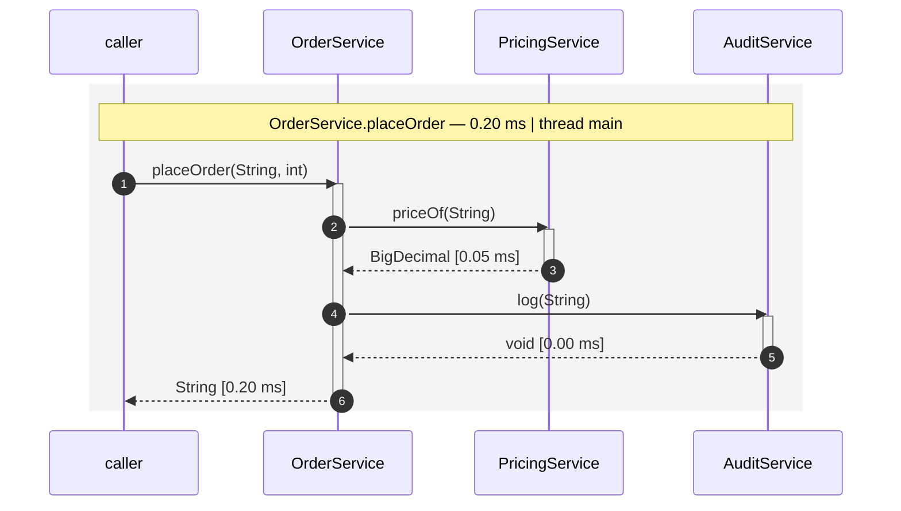

# jawelte-flow-assert-module

Records the CDI call-flow of a test method and asserts it against an expected
sequence-diagram.

A test can already pin what a call left in the database (`db-testdata-module`) and what an
endpoint answered (`content-diff-module`, `jaxrs-module`). This module pins **how** it got
there: which bean called which, in what order, how deep, and what came back.

```java
@EnableFlowAssert
class OrderServiceFlowTest {

    @Inject
    private OrderService orderService;

    @Test
    @ExpectedFlow                                  // flows/OrderServiceFlowTest/placesOrder.mmd
    void placesOrder() {
        assertThat(orderService.placeOrder("SKU-1", 2)).isEqualTo("SKU-1@5");
    }
}
```



## The recorder it builds on

The recording itself is done by **cdi-flow**, a portable CDI extension that attaches a
recording interceptor while the container boots and hands every finished call-chain to a
sink registry. It lives in its own repository:

**https://github.com/os890/dynamic-cdi-flow-renderer**

| | |
|---|---|
| Coordinates | `org.os890.cdi.uml:dynamic-cdi-flow-renderer` |
| Version used here | `0.9.0` (property `cdi.flow.version` in the root POM) |
| Scope | `compile` on `flow-assert-module/impl`, so a consumer gets the recorder — and with it the portable extension — by depending on the impl jar alone |

Nothing has to be built or installed first: the release lives in a plain Maven repository
served over GitHub Pages, and the root POM declares it, so `mvn install` resolves it like
any other dependency.

```xml
<repositories>
    <repository>
        <id>os890</id>
        <url>https://os890.github.io/os890-maven-repo/</url>
    </repository>
</repositories>
```

A project that consumes `jawelte-flow-assert-module-impl` needs that same repository in its
own POM — a `<repositories>` entry is not inherited through a dependency's POM.

## What gets compared

The **combined diagram of the test method** — one block per outermost call, in the order
they happened, sharing the participant lanes. A flow ends when its outermost call returns,
so a method that calls two services produces two blocks, and neither of them can quietly
disappear. Identical chains are *not* collapsed and their number is *not* capped: an
assertion has to see a call that happened twice.

Compared: participants reached, calls, returned and thrown types, CDI event arrows, folded
loop counts, nesting depth, and the number and order of chains.

Not compared: durations, timestamps, thread names, notation boilerplate, hotspot markers
and the diagram title — everything that differs from one run to the next. They are still
*rendered*, so a checked-in diagram stays readable; opt into comparing them per assertion
with `comparingTimings()`, `comparingHotspots()`, `comparingTitle()`.

The test class itself is not recorded. It is a CDI bean, so recording it would make the
test method the entry point of the flow and pull `@TestBean` mocks and test helpers into
the diagram. `@EnableFlowAssert(recordTestClass = true)` opts in.

## The notation follows the expected file

`.mmd` / `.mermaid` is compared as Mermaid, `.puml` / `.plantuml` / `.iuml` as PlantUML, and
any other extension belongs to whichever `FlowDialect` claims it. The recording is rendered
in the notation the expectation is written in, so switching an assertion from one to the
other is a rename of the expected file and nothing else. The recorder's own
`cdi-flow.output-format` plays no part in a comparison.

Because both built-in dialects render *through the recorder*, a `use-case.mmd` copied out of
a real application run is a valid expected file.

## API

| Type | Purpose |
|---|---|
| `@EnableFlowAssert` | Class-level switch; its attributes are the recording's configuration (`include`, `exclude`, `stereotypes`, `foldLoops`, `hotspotThresholdMillis`, `recordTestClass`, `writeTo`). Meta-annotated `@EnableTestBeans`, so it boots the lifecycle on its own |
| `@ExpectedFlow` | Per-method assertion, evaluated right after the method returns. An empty value resolves by convention: `flows/<TestClass>/<method><extension>` |
| `FlowDiff` | Fluent assertion — `forRecordedFlows()`, `forEntryPoint(...)`, `forFlow(...)`, then `expected(...)` / `expectedContent(...)`, the `ignoring…` filters, and `assertEquals()` |
| `RecordedFlows` | What was recorded: `all()`, `single()`, `byEntryPoint(...)`, `combinedDiagram(format)`, `clear()`, `awaitFlowCount(...)` |
| `FlowAssertConfig` | The MicroProfile Config keys and their lookup, all defaulted in `flow-assert-module/impl`'s `META-INF/microprofile-config.properties` |

```java
FlowDiff.forRecordedFlows()
        .expected("flows/order-placement.puml")      // → PlantUML, same recording
        .ignoringSubtree("AuditService#log(*)")
        .assertEquals();
```

## SPI

| Port | Contract |
|---|---|
| `FlowDialect` | One notation: `render(flows)`, `renderSingle(flow)`, `parse(diagram)` into the canonical `FlowStep` model, plus the file extensions it claims. Selected by the extension of the expected resource, `@Priority` breaking ties |
| `FlowDiffEngine` | The comparison, on `FlowStep`s rather than on text — which is why a custom dialect inherits it instead of bringing one. One active implementation per JVM |
| `FlowRecordingPort` | What the running test method recorded; swap it to capture flows differently |

A custom notation therefore implements **one** method pair (render / parse) and gets the
alignment, the ignore lists, the timing handling and the failure message for free.

## When it does not match

```
Flow diff found 2 difference(s) against flows/order-placement.mmd (mermaid):
  [chain 1, expected line 11] DIFFERENT_TARGET
        expected: OrderService -> PricingService: priceOf(String)
          actual: OrderService -> DiscountService: priceOf(String)
  [chain 1, expected line 16] MISSING_CALL
        expected: OrderService -> AuditService: log(String)
          actual: <missing>

recorded flow (mermaid):
    1  sequenceDiagram
    …
>  11              OrderService->>DiscountService: priceOf(String)
    …
recorded diagram written to: …/target/flow-diagrams/OrderServiceFlowTest/placesOrder.actual.mmd
```

The chains are matched before their steps, so an outermost call too many is one
`UNEXPECTED_CHAIN` rather than a diff as long as the diagram. Inside a chain the two step
sequences are aligned by longest common subsequence, so a gap holding one step on either
side is reported as the single thing that changed — `DIFFERENT_TARGET`,
`DIFFERENT_SIGNATURE`, `DIFFERENT_RETURN`, `LOOP_COUNT` — and a step that exists on both
sides at another position as `WRONG_ORDER`.

## Writing the first expected file

Let the recording write it, then read it before you trust it:

```bash
mvn test -Dorg.os890.jawelte.module.flowassert.api.FlowAssertConfig.create-missing-expected=true
```

The run that creates the file still **fails**, with the diagram in the message and the path
it wrote to. An approval nobody looked at is not an assertion.

## Known limitations

Inherited from the recorder: self-invocation is not recorded (no interceptor runs for
`this.other()`), only public methods are recorded, beans from producer methods are not
managed and therefore not intercepted, and argument *values* are never recorded — only
parameter types.

From this module: a flow does not cross threads, so an asynchronous CDI observer records a
flow of its own and is only captured if it finishes before the assertion —
`RecordedFlows.awaitFlowCount(n, timeout)` is the deterministic handle. A recording spanning
more than one test method is not supported.
