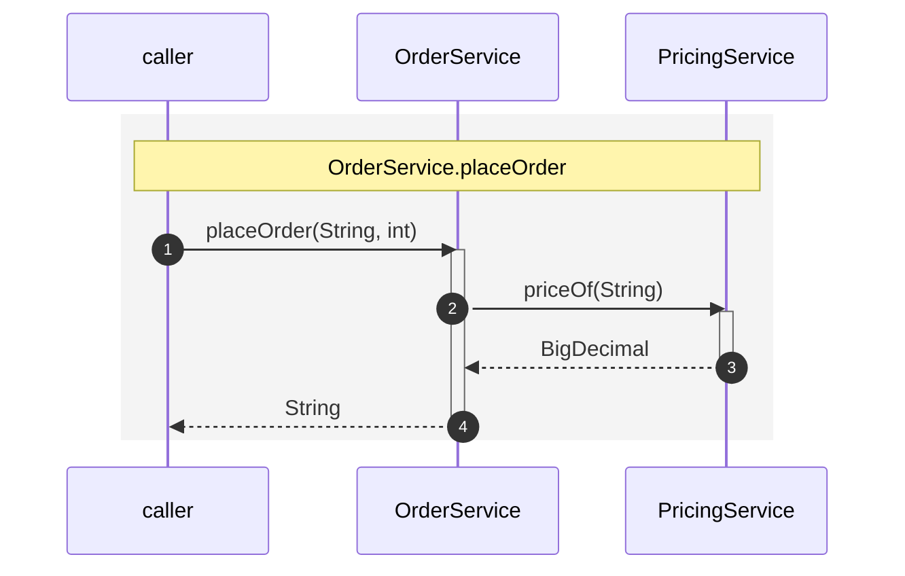

# flow-assert: asserting the call flow itself

Other modules pin what a call left in the database and what an endpoint answered. This one pins
**how** it got there: which bean called which, in what order, how deep, and what came back.

```java
@EnableFlowAssert
class OrderServiceFlowTest {

    @Inject
    OrderService orderService;

    @Test
    @ExpectedFlow                       // flows/OrderServiceFlowTest/placesOrder.mmd
    void placesOrder() {
        assertThat(orderService.placeOrder("SKU-1", 2)).isEqualTo("SKU-1@5");
    }
}
```

`@ExpectedFlow` with no value resolves by convention to
`flows/<TestClassSimpleName>/<methodName><ext>` on the test classpath, probing the extension of
every registered dialect — `.mmd` for mermaid, `.puml` for PlantUML — so the extension you commit
also picks the notation. `value()` names a resource explicitly; `ignoring()` drops participants or
calls from the comparison.

`@EnableFlowAssert` is meta-annotated with `@EnableTestBeans`. Without the annotation nothing is
recorded, so the module costs nothing when unused.

## The expected diagram

Mermaid `sequenceDiagram` (PlantUML is also supported, and a custom dialect can be registered
through the SPI):



The `rect` block and its `Note over` line are **not decoration** — they delimit one chain and name
its entry point, and the comparison is chain by chain. Drop them and the diff reports
`MISSING_CHAIN` for the chain it expected plus `UNEXPECTED_CHAIN` for
`OrderService.placeOrder`, however well the arrows inside line up.

What the recorder writes carries timings the expectation does not need — `— 7.92 ms | thread main`
on the note, `[6.47 ms]` on each return. Those are ignored by the comparison, so strip them for
readability or leave them in; both match.

**Compared:** participants reached, calls, returned and thrown types, CDI event arrows, folded
loop counts, nesting depth, and the number and order of chains.

**Not compared:** durations, timestamps, thread names, notation boilerplate, hotspot markers.

The unit of comparison is the whole test method — one block per outermost call, in the order they
happened. A method that calls two services produces two blocks and neither can quietly vanish.
Identical chains are **not** collapsed and their number is **not** capped: an assertion has to be
able to see that a call happened twice.

## Getting the diagram in the first place

Set `writeTo` on `@EnableFlowAssert` to have the recorded flow written out, then review it and
commit it as the expectation. Do not hand-write the first version — record it, read it, and keep
it only if it describes the design you intended.

## `@EnableFlowAssert` attributes

| Attribute | Effect |
| --- | --- |
| `include` | pattern of beans to record |
| `exclude` | patterns to skip |
| `stereotypes` | record only beans carrying these stereotypes |
| `foldLoops` | default `true` — collapse repeated identical calls into a counted loop |
| `hotspotThresholdMillis` | mark calls slower than this; `-1` disables |
| `recordTestClass` | default `false` — include calls originating in the test class itself |
| `writeTo` | directory to write the recorded diagram to |

## Inspecting flows programmatically

```java
RecordedFlows.all()              // every flow recorded for the current test method
RecordedFlows.single()           // the only one, or an error if there are several
RecordedFlows.single().entryTypeSimpleName()
```

A recorded flow is a list of `FlowStep` records — `kind` (`PARTICIPANT`, `CHAIN_START`, `CALL`,
`RETURN`, …), `from`, `to`, `label`, `chainIndex` and `depth` — so an assertion can be written
against the structure directly when a diagram is the wrong granularity.

`FlowDiff` is the fluent equivalent of `@ExpectedFlow` when you need to build the comparison in
code: `FlowDiff.forRecordedFlows()`, `.forEntryPoint(OrderService.class)`,
`.forEntryPoint(OrderService.class, "placeOrder")` or `.forFlow(flow)`.

## The recorder underneath

Recording is done by **cdi-flow** (`org.os890.cdi.uml:dynamic-cdi-flow-renderer`), a portable CDI
extension that attaches a recording interceptor at boot. It comes transitively with
`flow-assert-module-impl` at `compile` scope, from the same GitHub Pages repository as jawelte —
so the consuming POM needs the `<repositories>` entry, but nothing has to be built or installed.
